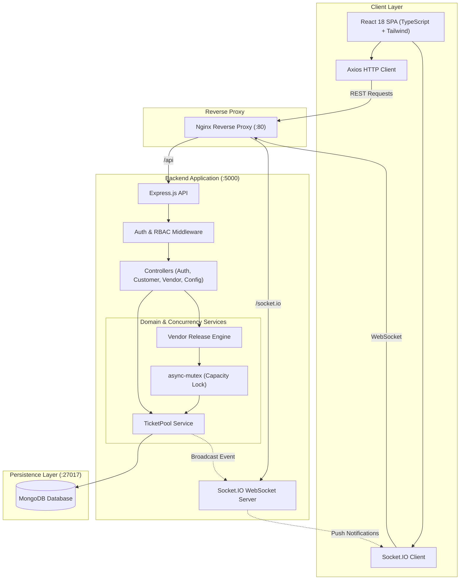
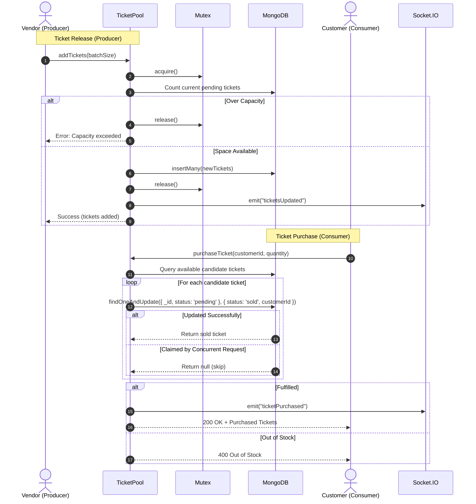

# WavePass

A real-time event ticketing platform built with Node.js, Express, MongoDB, and React. Engineered to handle high-concurrency ticket releases and purchases, preventing race conditions through database-level atomic operations and asynchronous mutual exclusion.

---

## Table of Contents

- [Overview](#overview)
- [Tech Stack](#tech-stack)
- [Architecture](#architecture)
- [Concurrency & Race-Condition Handling](#concurrency--race-condition-handling)
- [Security & Access Control](#security--access-control)
- [Real-Time Events (Socket.IO)](#real-time-events-socketio)
- [API Reference](#api-reference)
- [Testing](#testing)
- [Getting Started](#getting-started)
- [Docker Deployment](#docker-deployment)
- [Project Structure](#project-structure)
- [Engineering Decisions](#engineering-decisions)
- [Future Improvements](#future-improvements)

---

## Overview

High-demand ticketing events often experience sudden spikes in concurrent traffic. Without proper synchronization, simultaneous requests can cause overselling beyond venue capacity, double-allocation of tickets to multiple users, or inconsistent application state.

WavePass solves these concurrency challenges using a **Producer-Consumer** architecture:
- **Vendors (Producers)** release batches of tickets into a central **TicketPool**.
- **Customers (Consumers)** purchase tickets from the pool concurrently.
- **Mutual Exclusion & Atomicity** ensure that tickets are never double-sold and that total inventory stays within configured limits.
- **WebSockets** push instant inventory and sales updates to connected clients and vendor dashboards.

---

## Tech Stack

- **Frontend**: React 18, TypeScript, Vite, Tailwind CSS, React Router, Chart.js, Socket.IO Client
- **Backend**: Node.js, Express.js, Socket.IO, `async-mutex`, `express-validator`, Winston, Helmet, Rate Limiter
- **Database**: MongoDB & Mongoose (with compound indexing and atomic conditional operators)
- **Testing**: Jest, Supertest
- **DevOps**: Docker, Docker Compose, Nginx

---

## Architecture

### System Flow



### Producer-Consumer Flow



---

## Concurrency & Race-Condition Handling

### Asynchronous Concurrency in Node.js

Although Node.js runs application JavaScript on a single-threaded event loop, race conditions can still happen whenever execution crosses an asynchronous boundary (`await`, network requests, or database queries). 

In a naive read-modify-write pattern:
```javascript
// ❌ Unsafe: race condition under concurrency
const ticket = await Ticket.findOne({ status: 'pending' });
// Execution yields here during DB I/O. Another request reads the same ticket!
ticket.status = 'sold';
ticket.customerId = customerId;
await ticket.save();
```
If two requests query the same ticket concurrently, both see it as `pending`, and both assign it to different users.

### Two-Tier Concurrency Model

WavePass uses two complementary mechanisms to prevent race conditions:

#### 1. Database-Level Atomic Conditional Updates (`findOneAndUpdate`)
For ticket purchases and refunds, operations rely on atomic conditional filters directly in MongoDB:
```javascript
const claimedTicket = await Ticket.findOneAndUpdate(
  {
    _id: candidateTicket._id,
    status: 'pending', // Predicate: only update if still pending
  },
  {
    $set: {
      status: 'sold',
      customerId: new mongoose.Types.ObjectId(customerId),
      purchaseTime: new Date(),
    },
  },
  { new: true }
);
```
MongoDB guarantees document-level atomicity. If multiple concurrent requests target the same ticket, exactly one succeeds in matching `status: 'pending'` and transitioning it to `'sold'`. All other requests fail the filter, receive `null`, and move to the next candidate without race conditions or locks.

#### 2. In-Memory Mutual Exclusion (`async-mutex`)
For batch ticket releases, calculating remaining capacity and writing multiple records spans several asynchronous steps. The critical section is wrapped in a mutex:
```javascript
const release = await this.mutex.acquire();
try {
  const currentCount = await Ticket.countDocuments({ status: 'pending' });
  if (currentCount + tickets.length > this.maxCapacity) {
    throw new AppError(`Cannot add ${tickets.length} tickets. Pool capacity would be exceeded.`, 400);
  }
  return await Ticket.insertMany(tickets);
} finally {
  release(); // Always released in finally block
}
```
This guarantees that concurrent vendor releases cannot interleave their capacity checks and exceed `maxTicketCapacity`.

> **Scaling Note:** The in-memory mutex (`async-mutex`) serializes releases within a single Node.js process. In a multi-instance deployment behind a load balancer, cross-process mutual exclusion would use a distributed lock (such as Redis Redlock), while MongoDB's atomic document operations (`findOneAndUpdate`) remain safe across any number of server instances.

---

## Security & Access Control

- **JWT Authentication**: Users receive signed JSON Web Tokens upon authentication.
- **Role-Based Access Control (RBAC)**: Custom middleware ([`authorizeRole.js`](file:///c:/Users/HP/Desktop/wavepass-ticketing-system/server/middleware/authorizeRole.js)) isolates customer endpoints from vendor administrative operations.
- **Ownership Verification**: Custom middleware ([`checkOwnership.js`](file:///c:/Users/HP/Desktop/wavepass-ticketing-system/server/middleware/checkOwnership.js)) ensures customers can only inspect or refund their own tickets, preventing Broken Object Level Authorization (BOLA/IDOR).
- **Password Security**: Password hashes are generated with `bcryptjs` and automatically stripped from JSON outputs using Mongoose `toJSON` transforms.
- **Rate Limiting**: Brute-force protection on `/api/auth/*` routes via `express-rate-limit`.
- **HTTP Headers**: Enforces secure HTTP headers using `helmet`.

---

## Real-Time Events (Socket.IO)

| Event Name | Direction | Payload | Description |
| :--- | :--- | :--- | :--- |
| `register` | Client -> Server | `customerId` | Joins a private customer socket room. |
| `registerVendor` | Client -> Server | `vendorId` | Joins a private vendor channel. |
| `ticketsUpdated` | Server -> Broadcast | `{ total, sold, pending }` | Emitted when pool counts change. |
| `ticketPurchased` | Server -> Broadcast | `{ ticketId, customerId, eventName }` | Emitted when an order completes. |
| `ticketRefunded` | Server -> Broadcast | `{ ticketId, customerId }` | Emitted when a ticket is returned. |
| `ticketsAdded` | Server -> Vendor | `{ count, addedTickets }` | Confirms batch release completion. |

---

## API Reference

All responses follow a standard envelope:

**Success**:
```json
{
  "success": true,
  "data": { ... }
}
```

**Error**:
```json
{
  "success": false,
  "error": {
    "code": "OUT_OF_STOCK",
    "message": "Only 2 tickets were available for purchase."
  }
}
```

### Endpoints

| Method | Endpoint | Auth | Role | Description |
| :--- | :--- | :--- | :--- | :--- |
| `POST` | `/api/auth/register-customer` | Public | None | Register a customer account |
| `POST` | `/api/auth/login-customer` | Public | None | Login customer, returns JWT |
| `POST` | `/api/auth/register-vendor` | Public | None | Register a vendor account |
| `POST` | `/api/auth/login-vendor` | Public | None | Login vendor, returns JWT |
| `GET` | `/api/auth/me` | Bearer | Any | Fetch current user profile |
| `POST` | `/api/customer/purchaseTicket` | Bearer | `customer` | Atomically purchase tickets |
| `GET` | `/api/customer/tickets` | Optional | Any | Browse available (`pending`) tickets |
| `GET` | `/api/customer/tickets/:customerId` | Bearer | `customer` (Owner) | Get tickets for authenticated customer |
| `POST` | `/api/customer/refundTicket` | Bearer | `customer` (Owner) | Refund a purchased ticket |
| `POST` | `/api/vendor/releaseTickets` | Bearer | `vendor` | Release ticket batch to the pool |
| `GET` | `/api/vendor/tickets` | Bearer | `vendor` | View all released tickets |
| `GET` | `/api/vendor/tickets/:vendorId` | Bearer | `vendor` (Owner) | View tickets released by specific vendor |
| `GET` | `/api/vendor/analytics` | Bearer | `vendor` | View sales and capacity metrics |
| `GET` | `/api/config` | Bearer | Any | Retrieve system configuration |
| `POST` | `/api/config` | Bearer | `vendor` | Update system configuration |
| `GET` | `/api/health` | Public | None | Liveness health check |

---

## Testing

The test suite includes **10 test suites (38 automated tests)** covering unit logic, REST endpoints, and concurrency stress scenarios:

- **Unit**: Singleton configuration, input boundaries, in-memory pool operations, password hashing, and token verification.
- **Integration**: Customer and vendor authentication, ticket browsing, purchase validation, and refund flows.
- **Concurrency**:
  - `concurrentPurchases.test.js`: Fires **50 concurrent buyer requests** against 10 available tickets using `Promise.all()`. Verifies zero double-allocations, exactly 10 tickets sold, and 40 out-of-stock rejections.
  - `concurrentRelease.test.js`: Multiple vendors releasing tickets simultaneously at maximum capacity boundary.
  - `concurrentPurchaseRefund.test.js`: Interleaved concurrent purchases and refunds verifying consistent state.

### Running Tests

```bash
cd server

# Run all test suites
npm test

# Run with test coverage report
npm run test:coverage
```

---

## Getting Started

### Prerequisites
- Node.js >= 18 LTS
- npm >= 9
- MongoDB instance (or Docker)

### Local Setup

1. **Configure Environment Files**:
   ```bash
   cp server/.env.example server/.env
   cp client/.env.example client/.env
   ```

2. **Start Backend**:
   ```bash
   cd server
   npm install
   npm run dev
   ```

3. **Start Frontend** (in a separate terminal):
   ```bash
   cd client
   npm install
   npm run dev
   ```

The frontend will run at `http://localhost:5173` and the backend at `http://localhost:5000`.

> **Note on Payments:** The checkout interface in [`PaymentPage.tsx`](file:///c:/Users/HP/Desktop/wavepass-ticketing-system/client/src/components/PaymentPage.tsx) is a simulated flow for demonstration. No actual credit card transactions take place, and no payment credentials are saved.

---

## Docker Deployment

To spin up the entire full-stack environment (frontend, backend, and MongoDB) with a single command:

```bash
# Build and run all services in detached mode
docker compose up --build -d

# Check service status
docker compose ps

# View live logs
docker compose logs -f

# Stop containers
docker compose down
```

### Access Points
- **Frontend App**: `http://localhost` (Port 80 via Nginx reverse proxy)
- **Backend API**: `http://localhost:5000`
- **MongoDB**: `localhost:27017`

---

## Project Structure

```
wavepass-ticketing-system/
├── docker-compose.yml            # Multi-container orchestration
├── README.md                     # System documentation
│
├── client/                       # React 18 Frontend
│   ├── Dockerfile                # Multi-stage production build
│   ├── nginx.conf                # Nginx reverse proxy and SPA routing
│   ├── src/
│   │   ├── components/           # UI views (Dashboards, Payment, Navbar)
│   │   ├── context/              # Auth and WebSocket state providers
│   │   ├── services/api.ts       # Axios client with interceptors
│   │   └── types/types.ts        # TypeScript interface definitions
│   └── vite.config.ts
│
└── server/                       # Node.js Express Backend
    ├── Dockerfile                # Node 18 Alpine production image
    ├── server.js                 # App entry point and WebSocket setup
    ├── classes/                  # Domain services (TicketPool, Vendor, Config)
    ├── controllers/              # REST route handlers
    ├── middleware/               # Auth, RBAC, ownership, validation, errors
    ├── models/                   # Mongoose schemas (Ticket, Customer, Vendor)
    ├── routes/                   # API route definitions
    ├── tests/                    # Unit, integration, and concurrency tests
    └── utils/                    # Structured logger, response helper, error classes
```

---

## Engineering Decisions

1. **MongoDB Atomicity over Global Locks for Purchases**: Rather than locking the entire application for every purchase, WavePass uses atomic conditional updates (`findOneAndUpdate` with `status: 'pending'`). This keeps the backend non-blocking, allowing parallel customer checkouts while guaranteeing zero double-allocations at the database level.
2. **Synchronous Allocation with Real-Time Broadcasts**: The purchase endpoint directly returns the confirmed allocated tickets in the HTTP response body while simultaneously broadcasting state updates over WebSockets. This eliminates lost tickets caused by disconnected or reloaded clients.
3. **Decoupled Domain Layer**: Core business rules and concurrency primitives are encapsulated in the `TicketPool` domain class, allowing concurrency tests to be executed independently from HTTP middleware and headers.

---

## Future Improvements

- **Distributed Locks**: Integrate Redis with Redlock for cross-instance mutual exclusion when scaling the backend across multiple container instances.
- **Idempotency Keys**: Accept `Idempotency-Key` headers on purchase endpoints to protect against duplicate orders from client network retries.
- **Message Queue Ingress**: Buffer high-volume ticket requests through RabbitMQ or Apache Kafka during flash-sale events to prevent database connection saturation.
- **Payment Gateway Integration**: Connect checkout to Stripe Elements or PayPal SDK with webhook signature validation.