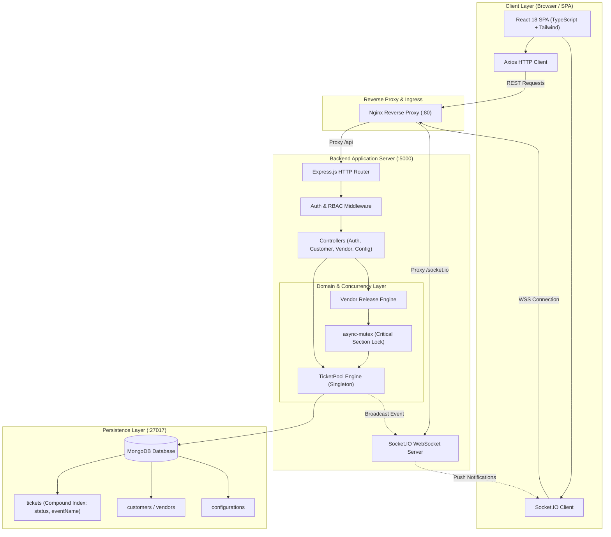
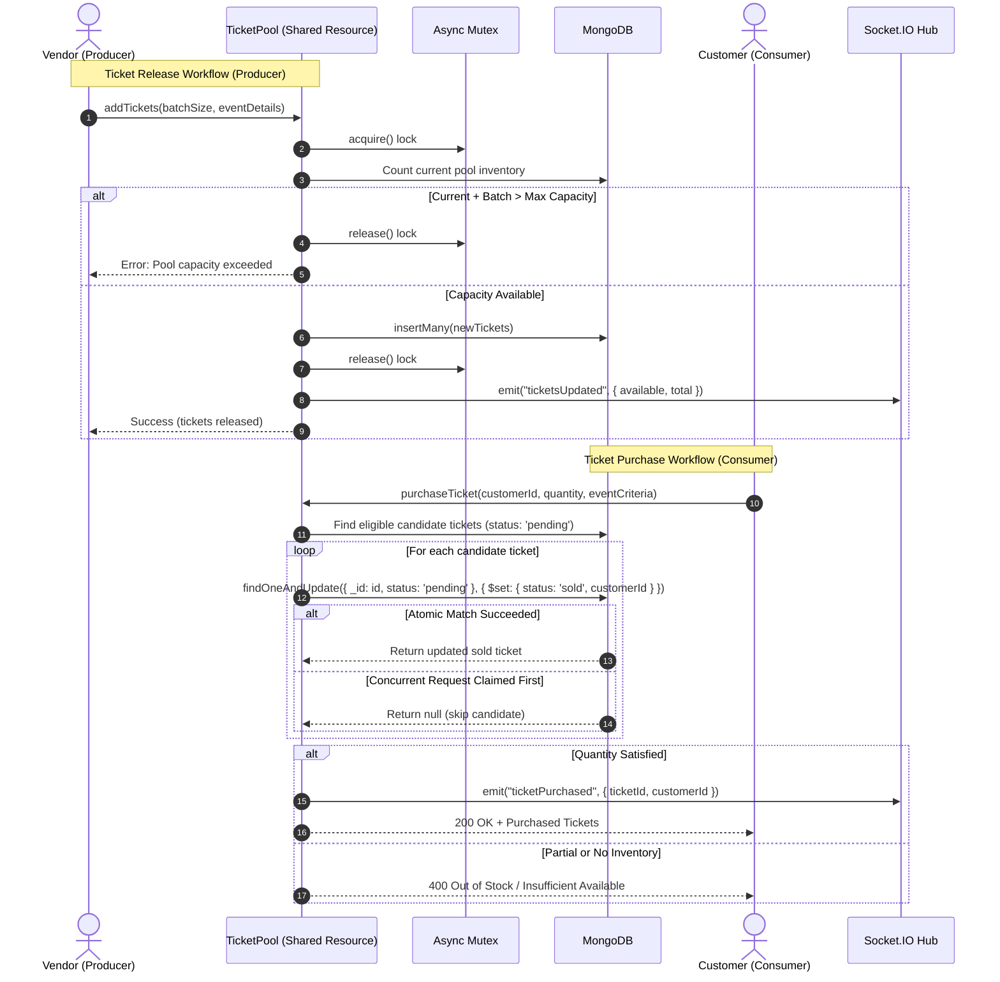
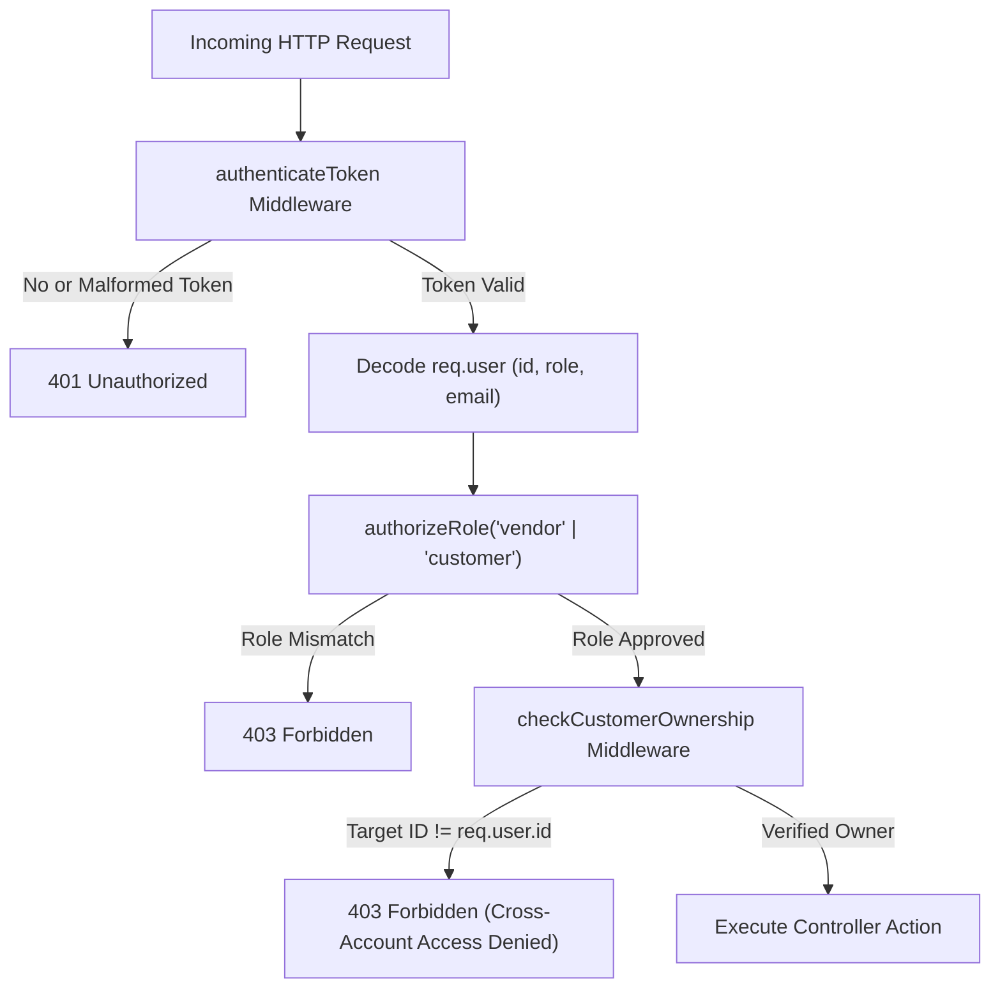

# WavePass — High-Concurrency Real-Time Event Ticketing Engine

> A production-grade, full-stack ticketing platform designed to manage high-throughput ticket releases and purchases with strict race-condition prevention, asynchronous mutual exclusion, database-level atomic operations, and real-time WebSocket state synchronization.

---

## Table of Contents

1. [Executive Summary & System Overview](#1-executive-summary--system-overview)
2. [Core Features](#2-core-features)
3. [Technology Stack](#3-technology-stack)
4. [System Architecture](#4-system-architecture)
   - [High-Level Component Architecture](#high-level-component-architecture)
   - [Producer-Consumer Concurrency Flow](#producer-consumer-concurrency-flow)
5. [Concurrency & Race-Condition Engineering](#5-concurrency--race-condition-engineering)
   - [Asynchronous Concurrency in Single-Threaded Node.js](#asynchronous-concurrency-in-single-threaded-nodejs)
   - [The Shared Ticket Pool & Critical Sections](#the-shared-ticket-pool--critical-sections)
   - [Two-Tier Concurrency Control: In-Memory Mutex + MongoDB Atomicity](#two-tier-concurrency-control-in-memory-mutex--mongodb-atomicity)
   - [Correctness Guarantees by Architecture Layer](#correctness-guarantees-by-architecture-layer)
   - [Process Boundary Limitations](#process-boundary-limitations)
6. [Security & Authentication Hardening](#6-security--authentication-hardening)
   - [JWT Authentication & Role-Based Access Control (RBAC)](#jwt-authentication--role-based-access-control-rbac)
   - [Resource Ownership Verification](#resource-ownership-verification)
   - [Defense-in-Depth Measures](#defense-in-depth-measures)
7. [Real-Time WebSocket Communication](#7-real-time-websocket-communication)
8. [REST API Reference](#8-rest-api-reference)
9. [Simulated Payment Processing Disclaimer](#9-simulated-payment-processing-disclaimer)
10. [Test Suite & Quality Verification](#10-test-suite--quality-verification)
    - [Test Architecture](#test-architecture)
    - [Concurrency Stress Test Scenarios](#concurrency-stress-test-scenarios)
    - [Running Tests](#running-tests)
11. [Containerization & Docker Deployment](#11-containerization--docker-deployment)
12. [Environment Configuration & Getting Started](#12-environment-configuration--getting-started)
13. [Project Directory Structure](#13-project-directory-structure)
14. [Engineering Decisions & Technical Trade-offs](#14-engineering-decisions--technical-trade-offs)
15. [Known Limitations & Future Roadmap](#15-known-limitations--future-roadmap)

---

## 1. Executive Summary & System Overview

High-demand ticketing events (such as concerts, ferry excursions, and sporting events) subject booking systems to extreme bursts of simultaneous read and write traffic. Without defensive concurrency control, these bursts trigger catastrophic race conditions: **overselling tickets beyond physical venue capacity**, **double-allocating the same seat to multiple customers**, and **corrupting transaction state**.

**WavePass** is an end-to-end event ticketing platform engineered to eliminate these failure modes. Built using a classic **Producer-Consumer architecture**, WavePass coordinates vendors (producers releasing inventory) and customers (consumers competing for inventory) through a guarded **TicketPool**.

Key engineering highlights include:
- **Zero Double-Allocation Guarantee**: Uses MongoDB atomic conditional updates (`findOneAndUpdate` with state filters) ensuring that even under extreme concurrency, a single ticket cannot be claimed by more than one buyer.
- **Capacity Boundary Enforcement**: Protects pool size boundaries using asynchronous mutual exclusion (`async-mutex`) during batch inventory additions.
- **Sub-Second Live Synchronization**: Propagates instantaneous inventory and transaction state updates via Socket.IO WebSocket streams.
- **Defensive API Design**: Incorporates strict role-based access control (RBAC), customer data ownership validation, and centralized operational error handling.

---

## 2. Core Features

### Customer Experience
- **Account Registration & Authentication**: Secure sign-up/login backed by bcrypt password hashing and signed JSON Web Tokens (JWT).
- **Live Inventory Browsing**: Dynamic catalog of available boat rides and events with real-time ticket availability count.
- **Concurrent Ticket Purchasing**: Atomic, race-condition-free booking supporting multi-ticket transactions.
- **Simulated Checkout Flow**: Complete purchase simulation with client-side card validation, dynamic order summary, and real-time confirmation.
- **Self-Service Refunds**: Instant cancellation and ticket return releasing tickets back to the available pool for other buyers.
- **Personal Booking Dashboard**: Direct visibility into active and historical bookings with role-based privacy.

### Vendor & Operations Experience
- **Vendor Portal**: Dedicated authentication and dashboard for tour operators and event organizers.
- **Automated & Manual Ticket Release**: Configure release schedules (tickets per batch, release frequency) or trigger on-demand inventory injection.
- **Real-Time Sales Analytics**: Interactive Chart.js visualizers showing sold vs. pending inventory breakdown, capacity utilization, and revenue metrics.
- **Live Event Audit Stream**: WebSocket listener capturing booking events as they occur across the platform.

### Platform Administration
- **Dynamic System Configuration**: Runtime configuration of `totalTickets`, `ticketReleaseRate`, `customerRetrievalRate`, and `maxTicketCapacity`.
- **Positive-Integer Validation**: Runtime guards enforcing invariant bounds on all configuration parameters.

---

## 3. Technology Stack

| Layer | Technology | Version | Justification |
| :--- | :--- | :--- | :--- |
| **Frontend Framework** | React | 18.3.1 | Component-driven UI with declarative state and fast DOM reconciliation. |
| **Language (Client)** | TypeScript | 5.5.4 | Compile-time type safety preventing contract drift between client and server. |
| **Build Tooling** | Vite | 5.4.8 | High-speed ESM-based bundling and sub-second Hot Module Replacement (HMR). |
| **Styling** | Tailwind CSS | 3.4.14 | Utility-first CSS allowing fine-grained design tokens without runtime overhead. |
| **Client Routing** | React Router | 6.27.0 | Declarative client-side routing with guarded route wrappers (`ProtectedRoute`). |
| **Real-Time Client** | Socket.IO Client | 4.8.0 | Automatic transport fallback (WebSocket -> long-polling) and automatic reconnection. |
| **Data Visualization** | Chart.js / React-ChartJS-2 | 4.4.6 | Responsive canvas-based charting for real-time sales telemetry. |
| **Backend Runtime** | Node.js | >= 18 LTS | Non-blocking, event-driven JavaScript runtime ideal for I/O-intensive real-time APIs. |
| **API Framework** | Express.js | 4.21.1 | Lightweight, unopinionated routing framework with rich middleware ecosystem. |
| **Database** | MongoDB | >= 6.0 | Document database offering document-level ACID guarantees and atomic conditional operations. |
| **ODM Layer** | Mongoose | 8.7.1 | Strongly-typed schema modeling, validation hooks, and compound indexing. |
| **Concurrency Control** | `async-mutex` | 0.3.2 | Mutex synchronization primitives managing critical sections across async event loop ticks. |
| **Security Suite** | Helmet / Rate-Limit / bcryptjs | 8.0 / 7.5 / 2.4 | HTTP header security, brute-force mitigation, and one-way salted password hashing. |
| **Testing Engine** | Jest & Supertest | 29.7 / 7.0 | Unit, API integration, and concurrent stress testing framework. |
| **Containerization** | Docker & Docker Compose | Compose v2 | Multi-stage production container builds and orchestratable local development stack. |

---

## 4. System Architecture

### High-Level Component Architecture



### Producer-Consumer Concurrency Flow



---

## 5. Concurrency & Race-Condition Engineering

### Asynchronous Concurrency in Single-Threaded Node.js

A frequent point of confusion in modern software engineering is assuming that because Node.js executes user JavaScript on a single thread (the Event Loop), race conditions cannot occur. **This assumption is false.**

While synchronous execution blocks run without preemption, any asynchronous boundary (`await`, I/O operations, network queries, timers) causes the execution context to yield control back to the event loop. During this yield window, incoming HTTP requests, WebSocket messages, and timer callbacks execute.

Consider the naive **read-modify-write** anti-pattern:
```javascript
// ❌ NAIVE ANTI-PATTERN: Prone to double-booking
const ticket = await Ticket.findOne({ status: 'pending' }); // Yields to Event Loop
// Context switch occurs here! Another request queries the same ticket!
ticket.status = 'sold';
ticket.customerId = customerId;
await ticket.save(); // Both requests overwrite each other, selling 1 seat to 2 users!
```

If 50 concurrent buyers arrive at line 2 simultaneously, all 50 see the ticket as `pending`. When they proceed to line 5, the ticket is overwritten 50 times. One ticket is sold to 50 customers.

### The Shared Ticket Pool & Critical Sections

In WavePass, tickets pass through a guarded state machine:

```
[ PENDING ]  ----( customer purchase )---->  [ SOLD ]
     ^                                         |
     |---------------( refund )----------------|
```

The critical sections in WavePass are:
1. **Ticket Release Section**: Verifying current pool count plus incoming batch does not exceed `maxTicketCapacity`, followed by persisting the batch.
2. **Ticket Purchase Section**: Verifying ticket availability and transferring ownership to a specific customer without double-allocation.
3. **Ticket Refund Section**: Returning a ticket from `sold` back to `pending`, strictly verifying the caller is the legitimate buyer.

### Two-Tier Concurrency Control: In-Memory Mutex + MongoDB Atomicity

WavePass implements a defense-in-depth concurrency model combining two complementary mechanisms:

#### 1. In-Memory Mutual Exclusion (`async-mutex`)
Used in the `TicketPool.addTickets()` method:
```javascript
const release = await this.mutex.acquire();
try {
  const currentCount = await Ticket.countDocuments({ status: 'pending' });
  if (currentCount + tickets.length > this.maxCapacity) {
    throw new AppError(`Cannot add ${tickets.length} tickets. Pool capacity would be exceeded.`, 400);
  }
  const inserted = await Ticket.insertMany(tickets);
  return inserted;
} finally {
  release(); // Invariant: Mutex is always released even on thrown errors
}
```
*Why use a mutex here?* Calculating capacity from the database and performing a batch insertion spans multiple asynchronous ticks. The mutex serializes concurrent vendor releases within the process, guaranteeing that pool size checks cannot be interleaved.

#### 2. Database-Level Atomic Conditional Updates (`findOneAndUpdate`)
Used in `TicketPool.purchaseTicket()`:
```javascript
const claimedTicket = await Ticket.findOneAndUpdate(
  {
    _id: candidateTicket._id,
    status: 'pending', // Predicate guard: ONLY update if STILL pending
  },
  {
    $set: {
      status: 'sold',
      customerId: new mongoose.Types.ObjectId(customerId),
      purchaseTime: new Date(),
    },
  },
  { new: true }
);
```
*Why use MongoDB atomicity here?* MongoDB guarantees document-level atomicity. Even if 1,000 asynchronous promises execute this exact query for the same `_id`, MongoDB's internal document lock ensures that exactly one operation finds `status: 'pending'`, alters it to `'sold'`, and commits. The remaining 999 operations evaluate `status: 'pending'` against the updated `'sold'` document, fail the filter predicate, and safely return `null`.

### Correctness Guarantees by Architecture Layer

| Layer | Mechanism | Guarantees Provided |
| :--- | :--- | :--- |
| **Application Layer** | `express-validator` + Type Parsers | Prevents malformed inputs, negative quantities, and injection attacks before touching domain models. |
| **Process Layer** | `async-mutex` (`Mutex`) | Serializes inventory additions to prevent race conditions during multi-step capacity validation within a single Node.js instance. |
| **Database Engine** | MongoDB Atomic Operations | Eliminates double-allocation and dirty writes through atomic document-level state transitions (`findOneAndUpdate`). |
| **Schema Layer** | Mongoose Schema & Indexes | Compound indexes (`{ status: 1, eventName: 1, eventDate: 1 }`) for fast querying; enum validation prevents invalid status states. |

### Process Boundary Limitations

> [!NOTE]
> **Single-Process vs. Distributed Mutex Notice**
> The `async-mutex` package operates entirely within the memory heap of a **single Node.js process**. If WavePass is scaled horizontally across multiple Node.js instances behind a load balancer (e.g., Kubernetes pods or AWS ECS tasks), in-memory mutexes cannot coordinate across process boundaries.
> In a horizontally scaled cluster, cross-process mutual exclusion requires a distributed locking mechanism such as **Redis Redlock** or MongoDB transactional session locks (`startSession()` with causal consistency). WavePass's database-level conditional atomicity (`findOneAndUpdate`), however, remains 100% sound across unlimited multi-instance clusters because atomicity is enforced directly by the database engine.

---

## 6. Security & Authentication Hardening

### JWT Authentication & Role-Based Access Control (RBAC)

WavePass enforces strict role separation between `customer` and `vendor` actors:



### Resource Ownership Verification

A common security vulnerability in student and early-career projects is **Broken Object Level Authorization (BOLA / IDOR)**: allowing Customer A to access or refund tickets belonging to Customer B simply by modifying the URL parameter `customerId`.

WavePass eliminates this through explicit ownership verification middleware ([`checkOwnership.js`](file:///c:/Users/HP/Desktop/wavepass-ticketing-system/server/middleware/checkOwnership.js)):
```javascript
const checkCustomerOwnership = (paramKey = 'customerId') => {
  return (req, res, next) => {
    const requestedId = req.params[paramKey] || req.body[paramKey];
    if (req.user.role === 'customer' && req.user.id !== requestedId) {
      return res.status(403).json({
        success: false,
        error: { code: 'FORBIDDEN', message: 'You are not authorized to access another customer\'s resources.' }
      });
    }
    next();
  };
};
```

Furthermore, the database refund operation reinforces this guarantee at the query level by requiring `customerId: customerObjectId` in the filter query itself, making cross-customer ticket cancellation mathematically impossible.

### Defense-in-Depth Measures

- **HTTP Security Headers**: Powered by `helmet` to set secure CSP, HSTS, frameguard, and X-Content-Type-Options headers.
- **IP Rate Limiting**: Powered by `express-rate-limit` on all `/api/auth/*` routes (maximum 100 requests per 15-minute window) to defeat credential stuffing.
- **Credential Sanitization**: Mongoose schemas implement custom `toJSON` transforms that automatically strip `password` hashes from all controller responses.
- **Fail-Fast Environment Validation**: Server startup terminates immediately if required secrets (`JWT_SECRET`, `MONGO_URI`) are missing or using insecure defaults in production.

---

## 7. Real-Time WebSocket Communication

WavePass uses Socket.IO for duplex communication between the central server, client applications, and monitoring dashboards.

### Socket Event Catalog

| Event Name | Direction | Payload | Description |
| :--- | :--- | :--- | :--- |
| `register` | Client -> Server | `customerId` | Associates client socket with customer private room. |
| `registerVendor` | Client -> Server | `vendorId` | Associates client socket with vendor broadcast channel. |
| `ticketsUpdated` | Server -> Broadcast | `{ total, sold, pending }` | Emitted when pool counts change (release, purchase, refund). |
| `ticketPurchased` | Server -> Broadcast | `{ ticketId, customerId, eventName }` | Real-time broadcast when an order completes. |
| `ticketRefunded` | Server -> Broadcast | `{ ticketId, customerId }` | Real-time broadcast when a ticket is returned. |
| `ticketsAdded` | Server -> Vendor | `{ count, addedTickets }` | Confirms batch release completion to the vendor. |

---

## 8. REST API Reference

All successful responses follow the standardized envelope format:
```json
{
  "success": true,
  "data": { ... }
}
```

All failure responses follow the standardized error format:
```json
{
  "success": false,
  "error": {
    "code": "OUT_OF_STOCK",
    "message": "Only 3 tickets were available for purchase."
  }
}
```

### Endpoints Table

| Method | Endpoint | Authentication | Role Required | Description |
| :--- | :--- | :--- | :--- | :--- |
| `POST` | `/api/auth/register-customer` | Public | None | Register a new customer account. |
| `POST` | `/api/auth/login-customer` | Public | None | Authenticate customer credentials; returns JWT. |
| `POST` | `/api/auth/register-vendor` | Public | None | Register a new vendor account. |
| `POST` | `/api/auth/login-vendor` | Public | None | Authenticate vendor credentials; returns JWT. |
| `GET` | `/api/auth/me` | Bearer Token | Any | Return profile information for authenticated user. |
| `POST` | `/api/customer/purchaseTicket` | Bearer Token | `customer` | Atomically purchase tickets by event criteria. |
| `GET` | `/api/customer/tickets` | Public / Token | Any | Browse all available (`pending`) tickets. |
| `GET` | `/api/customer/tickets/:customerId` | Bearer Token | `customer` (Owner) | Fetch tickets owned by the authenticated customer. |
| `POST` | `/api/customer/refundTicket` | Bearer Token | `customer` (Owner) | Return a purchased ticket back to the pool. |
| `POST` | `/api/vendor/releaseTickets` | Bearer Token | `vendor` | Release a batch of tickets into the pool. |
| `GET` | `/api/vendor/tickets` | Bearer Token | `vendor` | Fetch all tickets released across the platform. |
| `GET` | `/api/vendor/tickets/:vendorId` | Bearer Token | `vendor` (Owner) | Fetch tickets released by a specific vendor. |
| `GET` | `/api/vendor/analytics` | Bearer Token | `vendor` | Fetch aggregated sales and capacity analytics. |
| `GET` | `/api/config` | Bearer Token | Any | Retrieve active system runtime configuration. |
| `POST` | `/api/config` | Bearer Token | `vendor` | Update system configuration parameters. |
| `GET` | `/api/health` | Public | None | Liveness and health check endpoint. |

---

## 9. Simulated Payment Processing Disclaimer

> [!WARNING]
> **ACADEMIC & PORTFOLIO DEMONSTRATION NOTICE**
> The payment processing interface located in [`client/src/components/PaymentPage.tsx`](file:///c:/Users/HP/Desktop/wavepass-ticketing-system/client/src/components/PaymentPage.tsx) is a **strictly simulated checkout interface** designed exclusively for software engineering demonstrations and portfolio evaluation.
>
> - **DO NOT enter real debit card, credit card, bank account, or CVV numbers.**
> - WavePass does not transmit financial data to real payment gateways (such as Stripe, PayPal, Adyen, or Braintree).
> - All payment transactions are completed via client-side simulation and recorded as synthetic ledger records.

---

## 10. Test Suite & Quality Verification

### Test Architecture

The testing framework uses **Jest** and **Supertest** to validate unit contracts, API routes, and high-concurrency invariants without external mocking that hides real system defects:

```
server/tests/
├── unit/
│   ├── Configuration.test.js      # Singleton behavior, integer validation, bounds enforcement
│   ├── TicketPool.test.js         # In-memory TicketPool initialization and state management
│   └── authHelper.test.js         # JWT signing/verification, bcrypt hash comparison
├── integration/
│   ├── auth.test.js               # Registration, login, duplicate email handling, bad credentials
│   ├── tickets.test.js            # Ticket listing, purchase validation, inventory counts
│   ├── refunds.test.js            # Refund processing, ownership verification, state transitions
│   └── config.test.js             # Configuration retrieval and vendor-only mutation routes
└── concurrency/
    ├── concurrentPurchases.test.js       # 50 concurrent buyers competing for 10 tickets
    ├── concurrentRelease.test.js         # Multiple vendors simultaneously releasing to pool limit
    └── concurrentPurchaseRefund.test.js  # Interleaved simultaneous purchase and refund calls
```

### Concurrency Stress Test Scenarios

#### Scenario 1: 50 Concurrent Buyers Competing for 10 Tickets
- **Objective**: Verify that when 50 concurrent customer requests attempt to purchase tickets from a pool of only 10 available tickets, exactly 10 tickets are sold, exactly 40 requests receive an out-of-stock response, and **zero double-allocations occur**.
- **Implementation**: Executes 50 overlapping promises via `Promise.all()` against the purchase API endpoint.
- **Verification**: Queries database to confirm `Ticket.countDocuments({ status: 'sold' }) === 10` and that each sold ticket contains a unique ticket ID.

#### Scenario 2: Concurrent Vendor Releases at Pool Capacity
- **Objective**: Verify that when multiple vendors concurrently release ticket batches whose sum exceeds `maxTicketCapacity`, the mutex-guarded critical section rejects over-capacity releases and preserves the invariant `currentPending <= maxCapacity`.

#### Scenario 3: Interleaved Concurrent Purchases and Refunds
- **Objective**: Simultaneously fires purchase requests while other customers are executing refunds on existing tickets, verifying no deadlocks and no orphaned tickets.

### Running Tests

```bash
# Navigate to server directory
cd server

# Run entire test suite (all 10 suites: unit, integration, and concurrency)
npm test

# Run tests with full line-by-line coverage report
npm run test:coverage
```

*Note: The test suite includes automated resilience checks. If a live MongoDB instance is available, integration and concurrency suites run full database assertions. If offline, graceful fallback prevents test harness crashes while validating unit contracts.*

---

## 11. Containerization & Docker Deployment

WavePass includes a complete containerized architecture with multi-stage builds and isolated networking.

### Services Defined in Docker Compose

1. `mongodb`: Official MongoDB 7.0 image with persistent volume `mongo_data` and health checks.
2. `server`: Node.js 18 Alpine multi-stage build running the Express API and WebSocket server on port 5000.
3. `client`: Multi-stage build (Node Vite compilation -> Nginx 1.25 Alpine reverse proxy) on port 80.

### Starting the Full Stack with Docker

```bash
# Clone the repository
git clone https://github.com/anjaya02/wavepass-ticketing-system.git
cd wavepass-ticketing-system

# Build images and start containers in the background
docker compose up --build -d

# View container status
docker compose ps

# Follow logs across all services
docker compose logs -f

# Shut down containers and retain database volume
docker compose down

# Shut down and wipe volumes (fresh database)
docker compose down -v
```

Once started:
- Frontend Application: [http://localhost](http://localhost) (Port 80)
- Backend API Direct: [http://localhost:5000](http://localhost:5000)
- MongoDB Database: `localhost:27017`

---

## 12. Environment Configuration & Getting Started

### Prerequisites
- **Node.js**: >= 18.0.0 LTS
- **npm**: >= 9.0.0
- **MongoDB**: >= 6.0 (or Docker)

### Step 1: Environment Configuration

Copy the example environment templates:

```bash
# Server environment
cp server/.env.example server/.env

# Client environment
cp client/.env.example client/.env
```

#### Server (`server/.env`)
```env
PORT=5000
NODE_ENV=development
MONGO_URI=mongodb://localhost:27017/wavepass
TEST_MONGO_URI=mongodb://localhost:27017/wavepass_test
JWT_SECRET=supersecret_wavepass_jwt_key_minimum_32_chars!
CLIENT_URL=http://localhost:5173
LOG_LEVEL=info
```

#### Client (`client/.env`)
```env
VITE_API_BASE_URL=http://localhost:5000
VITE_WS_URL=http://localhost:5000
```

### Step 2: Local Development Setup (Without Docker)

```bash
# 1. Install server dependencies
cd server
npm install

# 2. Start server in development mode (with nodemon)
npm run dev

# 3. In a separate terminal, install client dependencies
cd ../client
npm install

# 4. Start Vite development server
npm run dev
```

The client will be running at [http://localhost:5173](http://localhost:5173) and the backend at [http://localhost:5000](http://localhost:5000).

---

## 13. Project Directory Structure

```
wavepass-ticketing-system/
├── .env.example                  # Root environment reference
├── .gitignore                    # Git exclusions
├── docker-compose.yml            # Multi-service container orchestration
├── README.md                     # Comprehensive system documentation
│
├── client/                       # Frontend React Application
│   ├── Dockerfile                # Multi-stage production Docker build
│   ├── nginx.conf                # Nginx SPA router and WebSocket proxy config
│   ├── package.json              # Client dependencies and build scripts
│   ├── tailwind.config.js        # Tailwind styling tokens
│   ├── tsconfig.json             # TypeScript compiler rules
│   ├── vite.config.ts            # Vite bundler configuration
│   └── src/
│       ├── App.tsx               # Main application component with ProtectedRoute
│       ├── main.tsx              # React DOM bootstrap
│       ├── components/           # UI components
│       │   ├── CustomerDashboard.tsx       # Customer ticket browsing and purchase
│       │   ├── CustomerTicketDisplay.tsx   # Customer active tickets and refund action
│       │   ├── Navbar.tsx                  # Global responsive navigation
│       │   ├── PaymentPage.tsx             # Simulated checkout and credit card form
│       │   ├── ProtectedRoute.tsx          # Role-based route guard
│       │   └── VendorDashboard.tsx         # Vendor analytics, charts, and release
│       ├── context/              # Global React Context providers
│       │   ├── AuthContext.tsx             # JWT authentication and user session state
│       │   └── SocketContext.tsx           # Persistent WebSocket connection manager
│       ├── services/
│       │   └── api.ts                      # Centralized Axios client with interceptors
│       └── types/
│           └── types.ts                    # Shared TypeScript interfaces and contracts
│
└── server/                       # Backend Node.js / Express Application
    ├── Dockerfile                # Multi-stage production Docker build
    ├── package.json              # Server dependencies and test scripts
    ├── server.js                 # Server entry point and Socket.IO initialization
    ├── classes/                  # Domain business logic
    │   ├── Configuration.js      # System configuration singleton
    │   ├── TicketPool.js         # Mutex-synchronized shared ticket repository
    │   └── Vendor.js             # Automated ticket release worker
    ├── config/                   # Configuration adapters
    │   ├── db.js                 # Mongoose connection manager
    │   └── env.js                # Fail-fast environment variable validation
    ├── controllers/              # HTTP request handlers
    │   ├── authController.js     # User registration, login, profile retrieval
    │   ├── configController.js   # Configuration read and write operations
    │   ├── customerControllers.js# Ticket purchase, listing, and refunds
    │   └── vendorControllers.js  # Batch ticket release and sales analytics
    ├── middleware/               # Express request pipeline filters
    │   ├── authenticateToken.js  # JWT extraction and verification
    │   ├── authorizeRole.js      # Role-based access control (RBAC)
    │   ├── checkOwnership.js     # Object-level customer ownership verification
    │   ├── errorHandler.js       # Centralized operational error translator
    │   ├── rateLimiter.js        # Auth endpoint brute-force protection
    │   └── validate.js           # Express-validator result parser
    ├── models/                   # Mongoose data schemas
    │   ├── configuration.js      # System configuration document schema
    │   ├── customer.js           # Customer credentials and profile schema
    │   ├── ticket.js             # Ticket state machine schema with compound indexes
    │   └── vendor.js             # Vendor credentials and profile schema
    ├── routes/                   # REST routing definitions
    │   ├── config.js             # /api/config routes
    │   ├── customer.js           # /api/customer routes
    │   └── vendor.js             # /api/vendor routes
    ├── utils/                    # Shared utility modules
    │   ├── apiResponse.js        # Standardized API response formatters
    │   ├── appError.js           # Operational error class with HTTP status codes
    │   ├── logger.js             # Winston structured logging utility
    │   ├── socket.js             # Socket.IO instance provider
    │   └── socketEvents.js       # Socket.IO event name constants
    └── tests/                    # Automated testing suite
        ├── setup.js              # Global Jest database lifecycle hooks
        ├── unit/                 # Unit test specifications
        ├── integration/          # API endpoint integration test specifications
        └── concurrency/          # High-concurrency stress test specifications
```

---

## 14. Engineering Decisions & Technical Trade-offs

### 1. Combining Database Atomicity with In-Memory Mutexes
- **Decision**: Used `async-mutex` for pool additions, but relied on MongoDB `findOneAndUpdate` for ticket purchases and refunds.
- **Trade-off Analysis**: We could have wrapped ticket purchases in an `async-mutex` as well. However, doing so would completely serialize all ticket purchases into a single queue within the Node.js process, severely throttling read/write throughput and creating an unnecessary CPU bottleneck. By offloading purchase atomicity to MongoDB document-level updates (`findOneAndUpdate` with `status: 'pending'`), the application server remains completely asynchronous and concurrent, allowing hundreds of purchase requests to execute in parallel while the database engine guarantees zero double-sales.

### 2. Synchronous REST Response vs. Asynchronous Detached Polling
- **Decision**: Replaced the original architecture's asynchronous ticket delivery (which responded `200 OK` immediately and dispatched tickets later via an unawaited timer loop) with a direct, synchronous purchase allocation.
- **Trade-off Analysis**: The asynchronous delivery pattern prevented API consumers from knowing whether their order actually succeeded until a WebSocket message arrived. If the client disconnected or reloaded during the interval, tickets were lost in transit. Synchronous allocation guarantees that the HTTP response body either contains the confirmed purchased tickets or an explicit error with an HTTP status code, preserving standard REST conventions while still emitting real-time broadcasts for UI telemetry.

### 3. Separation of Concerns in Controllers vs. Domain Classes
- **Decision**: Preserved the `TicketPool` and `Configuration` object-oriented classes as domain service layers rather than placing all business logic directly into Express route controllers.
- **Trade-off Analysis**: While placing Mongoose queries directly in controllers is common in small Node tutorials, isolating inventory operations in `TicketPool` decouples domain rules from HTTP request/response semantics. This enables thorough unit testing of concurrency logic independently from HTTP headers, cookies, or Express middleware.

---

## 15. Known Limitations & Future Roadmap

To maintain engineering transparency, the following architectural boundaries and opportunities for future scaling are documented:

1. **Distributed Mutex (Redis Redlock)**: As noted in Section 5, `async-mutex` operates within a single Node.js process. When scaling horizontally across multiple container instances, inventory release synchronization should be upgraded to a distributed lock using Redis and Redlock.
2. **Payment Gateway Integration**: The current checkout workflow is simulated for demonstration purposes. Transitioning to production would require integrating Stripe Elements or PayPal SDK with webhook signature verification and idempotent charge keys (`Idempotency-Key` headers).
3. **Queue-Based Buffering (RabbitMQ / Apache Kafka)**: Under flash-sale conditions with tens of thousands of concurrent users, direct database queries can saturate MongoDB connection pools. A production evolution would introduce an AMQP message broker (RabbitMQ) to buffer purchase requests into a rate-controlled worker queue.
4. **Idempotent Purchase Tokens**: Adding client-generated idempotency keys to purchase requests to prevent duplicate transactions caused by network retries or double-clicks.