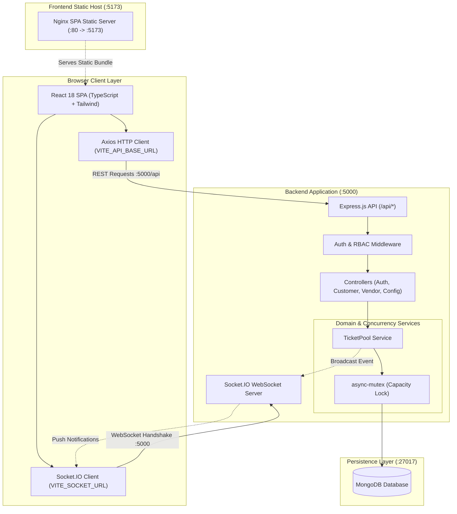

# WavePass

A real-time event ticketing platform built with Node.js, Express, MongoDB, and React. Engineered to handle high-concurrency ticket releases and purchases, preventing overselling and race conditions through database-level atomic operations, asynchronous mutual exclusion, and WebSocket real-time synchronization.

---

## Table of Contents

- [Overview](#overview)
- [Tech Stack](#tech-stack)
- [Architecture](#architecture)
- [Concurrency & Race-Condition Handling](#concurrency--race-condition-handling)
- [Data Consistency & Source of Truth](#data-consistency--source-of-truth)
- [Domain Concepts: totalTickets vs maxTicketCapacity](#domain-concepts-totaltickets-vs-maxticketcapacity)
- [Security & Access Control](#security--access-control)
- [Real-Time Events (Socket.IO)](#real-time-events-socketio)
- [API Reference](#api-reference)
- [Testing](#testing)
- [Getting Started](#getting-started)
- [Docker Deployment](#docker-deployment)
- [Project Structure](#project-structure)
- [Engineering Decisions](#engineering-decisions)
- [Future Improvements](#future-improvements)

---

## Overview

High-demand ticketing platforms experience abrupt spikes in concurrent traffic. Without rigorous synchronization, simultaneous requests cause:
- **Overselling** beyond venue or release limits.
- **Double-allocation** of the same ticket to multiple customers.
- **Capacity boundary races** where concurrent releases and refunds push available stock beyond maximum pool limits.
- **State desynchronization** between customer ownership records and ticket inventory.

WavePass models ticket distribution as a synchronized **Producer-Consumer** system:
- **Vendors (Producers)** release ticket batches into a shared pool.
- **Customers (Consumers)** purchase tickets concurrently via atomic conditional transitions.
- **Mutual Exclusion (`async-mutex`)** serializes release capacity checks and refund state transitions against pool boundaries.
- **Database-Level Atomicity (`findOneAndUpdate`)** guarantees zero double-sales without coarse-grained table locks.
- **Socket.IO WebSockets** push live inventory and order events to connected clients and vendor dashboards.

---

## Tech Stack

- **Frontend**: React 18, TypeScript, Vite, Tailwind CSS, React Router, Chart.js, Socket.IO Client, Axios
- **Backend**: Node.js, Express.js, Socket.IO, `async-mutex`, `express-validator`, Winston, Helmet, Rate Limiter
- **Database**: MongoDB & Mongoose (with compound indexing on `{ status: 1, eventName: 1, eventDate: 1 }` and atomic conditional operators)
- **Testing**: Jest, Supertest
- **DevOps**: Docker, Docker Compose, Nginx

---

## Architecture

### System Flow (Option A: Direct Client-to-Backend Architecture)

In this deployment architecture:
1. **Frontend**: Nginx serves the compiled React 18 SPA statically on container port 80 (mapped to host port **5173**).
2. **Backend**: Express and Socket.IO listen on port **5000**.
3. **Browser Direct Communication**: The browser loads the SPA from port 5173 and issues REST API calls (`/api/...`) and WebSocket connections directly to `http://localhost:5000` via configured environment variables (`VITE_API_BASE_URL` and `VITE_SOCKET_URL`).



---

## Concurrency & Race-Condition Handling

### Asynchronous Concurrency in Node.js

Node.js executes JavaScript on a single-threaded event loop, but concurrency races occur whenever an operation yields execution across asynchronous boundaries (`await`, network requests, or database queries).

A naive read-modify-write pattern causes overselling:
```javascript
// ❌ Unsafe: yields execution during DB query
const ticket = await Ticket.findOne({ status: 'available' });
// Context switches here. A concurrent request reads the exact same ticket!
ticket.status = 'sold';
ticket.owner = customerId;
await ticket.save();
```

WavePass eliminates concurrency bugs through a two-tier synchronization strategy:

### 1. Database-Level Atomic Conditional Updates (`findOneAndUpdate`)
Purchases do not lock the entire table. Instead, purchases target available tickets using atomic MongoDB conditional filters:
```javascript
const ticket = await Ticket.findOneAndUpdate(
  {
    _id: candidateTicket._id,
    status: 'available', // Atomic predicate: matches ONLY if still available
  },
  {
    $set: {
      status: 'sold',
      owner: customerId,
    },
  },
  { new: true }
);
```
MongoDB guarantees document-level atomicity. If 50 concurrent buyers attempt to purchase the same ticket, exactly one succeeds in transitioning `status: 'available' -> 'sold'`. The other 49 operations receive `null`, safely attempting the next candidate or terminating when stock is exhausted.

### 2. Mutex-Synchronized Pool Capacity Boundaries (`async-mutex`)
Vendor ticket releases and customer refunds both alter available ticket count relative to `maxTicketCapacity`:
- **Vendor Release**: Calculates remaining capacity, verifies against `totalTickets` lifetime cap, and inserts tickets.
- **Customer Refund**: Verifies pool has space (`availableCount < maxTicketCapacity`) and atomically reverts ticket from `'sold'` to `'available'`.

Without synchronization, a release and refund occurring concurrently near capacity can interleave:
1. Pool is at 9/10 capacity.
2. Vendor release checks capacity (9 < 10, space = 1) and prepares to insert 1 ticket.
3. Customer refund checks capacity (9 < 10, space = 1) and prepares to refund 1 ticket.
4. Both complete: available tickets = 11 > 10 (`maxTicketCapacity` violated!).

WavePass wraps both operations within the `TicketPool` private mutex:
```javascript
// Both addTickets and refundTicket run within this.#mutex.runExclusive()
await this.#mutex.runExclusive(async () => {
  const availableSpace = await this.getAvailableSpace(session);
  if (availableSpace <= 0) {
    throw new AppError("Ticket pool is currently at maximum capacity.", 400);
  }
  // Atomically transition sold ticket back to available
  const refunded = await Ticket.findOneAndUpdate(
    { _id: ticketId, owner: customerId, status: "sold" },
    { $set: { status: "available", owner: null } },
    { new: true }
  );
});
```
This guarantees the strict invariant:
$$\text{availableTickets} \le \text{maxTicketCapacity}$$
at all times under concurrent load.

---

## Data Consistency & Source of Truth

### Design Decision: `Ticket.owner` as Authoritative Truth

In an earlier prototype, customer purchases recorded ownership in two places:
1. `Ticket.owner` / `Ticket.status`
2. An array field `Customer.ticketsPurchased` on the Customer document

Maintaining dual writes across two separate collections without distributed multi-document transactions introduces desynchronization risk: if the ticket update succeeds but the customer document write fails, the database enters an inconsistent state.

**Resolution**:
- **Single Source of Truth**: The `Ticket` document (`status: "sold"`, `owner: customerId`) is the authoritative source of ownership.
- **Derived Retrieval**: The endpoint `GET /api/customers/:customerId/tickets` directly queries:
  ```javascript
  const tickets = await Ticket.find({ owner: customerId, status: "sold" }).lean();
  ```
- **Atomicity**: Purchases and refunds require modifying only the `Ticket` document, keeping operations fully atomic at the database level with zero dual-write vulnerabilities.

---

## Domain Concepts: `totalTickets` vs `maxTicketCapacity`

| Parameter | Domain Meaning | Enforcement |
| :--- | :--- | :--- |
| `totalTickets` | Maximum number of ticket records allowed in the system at one time. | Checked under mutex in `TicketPool.addTickets()`: `Ticket.countDocuments({}) + batch <= totalTickets`. |
| `maxTicketCapacity` | **Concurrent Pool Capacity**: The maximum number of *currently available* tickets that can sit in the pool buffer at any single moment. | Checked under mutex in `addTickets()` and `refundTicket()`: `availableCount <= maxTicketCapacity`. |

---

## Security & Access Control

- **JWT Authentication**: Secure JSON Web Tokens with HS256 signatures, verified via `authenticateToken` middleware and Socket.IO connection handshakes.
- **Role-Based Access Control (RBAC)**: Enforced via [authorizeRole.js](server/middleware/authorizeRole.js) (`customer` vs `vendor`).
- **Object-Level Ownership Authorization (BOLA/IDOR Protection)**: Enforced via [checkOwnership.js](server/middleware/checkOwnership.js) ensuring customers cannot inspect, purchase, or refund another customer's tickets by manipulating URL parameters.
- **Password Hashing**: Salted bcrypt (10 rounds) with password fields stripped from `toJSON()` serialization on Mongoose models.
- **Brute-Force Rate Limiting**: `express-rate-limit` protects `/api/customers/login`, `/api/customers/register`, `/api/vendor/login`, and `/api/vendor/register`.
- **CORS Configuration**: Restricts browser requests to permitted frontend origins while accepting legitimate server-to-server and automated test requests.

---

## Real-Time Events (Socket.IO)

Socket.IO authentication validates JWT tokens during the connection handshake (`io.use()`). Verified sockets are automatically placed into role-based and user-specific rooms (`role:customer`, `role:vendor`, `user:<id>`).

| Event Name | Direction | Payload | Description |
| :--- | :--- | :--- | :--- |
| `ticketUpdate` | Server -> Broadcast | `{ availableTickets, totalReleasedTickets }` | Emitted when available inventory changes. |
| `vendorReleasedTickets`| Server -> Broadcast | `{ releasedTickets, vendorId }` | Emitted when a vendor adds tickets to the pool. |
| `ticketSold` | Server -> Broadcast | `{ ticketId, customerId, price }` | Emitted when a ticket is purchased. |
| `purchaseFailure` | Server -> Broadcast | `{ customerId, message }` | Emitted when a purchase fails (e.g. out of stock). |
| `ticketRefunded` | Server -> Broadcast | `{ ticketId, customerId }` | Emitted when a ticket is refunded. |
| `systemStatus` | Server -> Broadcast | `{ status, message }` | Emitted for operational status notices. |

---

## API Reference

All responses follow a standard envelope:

**Success**:
```json
{
  "success": true,
  "message": "Operation completed successfully.",
  "data": { ... }
}
```

**Error**:
```json
{
  "success": false,
  "error": {
    "code": "TICKETS_UNAVAILABLE",
    "message": "No tickets available for purchase in the pool."
  },
  "message": "No tickets available for purchase in the pool."
}
```

### Complete Endpoints Table

| Method | Endpoint | Auth | Role | Description |
| :--- | :--- | :--- | :--- | :--- |
| `GET` | `/health` | Public | None | API health check and timestamp |
| `POST` | `/api/customers/register` | Public | None | Register a new customer account |
| `POST` | `/api/customers/login` | Public | None | Login customer and receive JWT |
| `GET` | `/api/customers/available-tickets` | Bearer | Any | Get current available ticket count |
| `GET` | `/api/customers/:customerId` | Bearer | `customer` (Owner) / `vendor` | Retrieve customer details |
| `POST` | `/api/customers/:customerId/purchase` | Bearer | `customer` (Owner) | Atomically purchase tickets |
| `GET` | `/api/customers/:customerId/tickets` | Bearer | `customer` (Owner) / `vendor` | View customer's purchased tickets |
| `POST` | `/api/customers/:customerId/refund` | Bearer | `customer` (Owner) | Refund a purchased ticket |
| `POST` | `/api/vendor/register` | Public | None | Register a new vendor account |
| `POST` | `/api/vendor/login` | Public | None | Login vendor and receive JWT |
| `POST` | `/api/vendor/add-tickets` | Bearer | `vendor` | Batch release tickets to pool |
| `POST` | `/api/vendor/start-release` | Bearer | `vendor` | Start automated background release |
| `POST` | `/api/vendor/stop-release` | Bearer | `vendor` | Stop automated background release |
| `DELETE`| `/api/vendor/delete-available-tickets`| Bearer | `vendor` | Delete all unsold tickets in pool |
| `GET` | `/api/vendor/my-tickets` | Bearer | `vendor` | Get tickets released by current vendor |
| `GET` | `/api/vendor/released-tickets` | Bearer | `vendor` | Get available tickets count for vendor |
| `GET` | `/api/vendor/total-released-tickets` | Bearer | `vendor` | Get total available tickets across all vendors |
| `GET` | `/api/vendor/sold-tickets` | Bearer | `vendor` | Get total sold tickets count |
| `GET` | `/api/vendor/ticket-pool` | Bearer | `vendor` | Get pool capacity metrics |
| `GET` | `/api/config/` | Public | None | Get active system configuration |
| `GET` | `/api/config/customer-retrieval-rate`| Public | None | Get retrieval rate configuration |
| `POST` | `/api/config/set` | Bearer | `vendor` | Update system configuration limits |
| `POST` | `/api/config/reset` | Bearer | `vendor` | Reset system configuration to defaults |

---

## Testing

The testing suite contains **10 test suites (39 automated tests)** spanning unit testing, REST API integration, and high-concurrency stress verification:

### Database-Aware Test Execution (`dbCheck.js`)
Tests requiring an active MongoDB connection utilize `describeIfDb` and `testIfDb`. If MongoDB is unavailable in the execution environment:
- Database-dependent tests are **explicitly reported as SKIPPED**;
- They **never pass silently** with early returns;
- Unit and static tests continue to execute and pass.

### Concurrency Stress Test Coverage
1. `concurrentPurchases.test.js`: Fires **50 concurrent buyer requests** at the exact same millisecond against 10 available tickets. Verifies zero double-allocations, exactly 10 tickets sold, 40 rejected with 409, and consistent database state.
2. `concurrentRelease.test.js`: Multiple vendors releasing tickets concurrently at the pool capacity boundary.
3. `concurrentPurchaseRefund.test.js`:
   - Interleaved concurrent purchases and refunds verifying exact stock conservation.
   - Concurrency race test simulating simultaneous vendor release and customer refund at the capacity boundary (`available <= maxTicketCapacity`).

### Running Tests

```bash
cd server

# Run all test suites
npm test

# Run with test coverage report
npm run test:coverage
```

---

## Getting Started

### Prerequisites
- Node.js >= 18 LTS
- npm >= 9
- MongoDB instance (local or remote)

### Local Setup

1. **Configure Environment Files**:
   ```bash
   cp server/.env.example server/.env
   cp client/.env.example client/.env
   ```

2. **Start Backend**:
   ```bash
   cd server
   npm install
   npm run dev
   ```

3. **Start Frontend** (in a separate terminal):
   ```bash
   cd client
   npm install
   npm run dev
   ```

The frontend runs at `http://localhost:5173` and the backend at `http://localhost:5000`.

> **Note on Payments:** The checkout interface in [PaymentPage.tsx](client/src/components/PaymentPage.tsx) is a simulated flow for demonstration. No actual credit card transactions take place, and no payment credentials are saved.

---

## Docker Deployment

To build and run the full stack using Docker Compose:

```bash
# Build and run all services in detached mode
docker compose up --build -d

# Check service status
docker compose ps

# View live logs
docker compose logs -f

# Stop containers
docker compose down
```

### Port Mappings
- **Frontend App**: `http://localhost:5173` (Container port 80 mapped to host 5173)
- **Backend API**: `http://localhost:5000` (Container port 5000 mapped to host 5000)
- **MongoDB**: `localhost:27017`

---

## Project Structure

```
wavepass-ticketing-system/
├── docker-compose.yml            # Multi-container orchestration
├── README.md                     # System documentation
│
├── client/                       # React 18 Frontend
│   ├── Dockerfile                # Multi-stage production build
│   ├── nginx.conf                # Nginx SPA static file server
│   ├── src/
│   │   ├── components/           # UI views (Dashboards, Payment, Navbar)
│   │   ├── context/              # AuthContext & SocketContext providers
│   │   ├── services/api.ts       # Centralized Axios client with JWT interceptors
│   │   └── types/types.ts        # TypeScript interface definitions
│   └── vite.config.ts
│
└── server/                       # Node.js Express Backend
    ├── Dockerfile                # Node 18 Alpine production image
    ├── server.js                 # App entry point, CORS, Socket.IO setup
    ├── classes/                  # Domain services (TicketPool, Configuration)
    ├── controllers/              # REST route handlers
    ├── middleware/               # Auth, RBAC, ownership, rateLimiter, validate
    ├── models/                   # Mongoose schemas (Ticket, Customer, Vendor, Configuration)
    ├── routes/                   # API route definitions (customer, vendor, config)
    ├── tests/                    # Unit, integration, and concurrency test suites
    └── utils/                    # Structured logger, response helper, error classes
```

---

## Engineering Decisions

1. **Document-Level Conditional Atomicity over Global Locks for Purchases**: Rather than locking the whole server for purchases, WavePass uses atomic conditional updates (`findOneAndUpdate` matching `status: "available"`). This keeps the system responsive under high concurrency while mathematically eliminating double-allocations.
2. **Single Source of Truth for Ownership**: Eliminating the redundant `Customer.ticketsPurchased` array removes multi-document dual-write failure modes without the performance penalty of multi-document distributed transactions.
3. **Mutex Synchronization for Capacity Boundaries**: Mutual exclusion is reserved strictly where multi-step checks are required: ensuring releases and refunds do not exceed `maxTicketCapacity` or `totalTickets`.
4. **Honest Test Reporting**: No silent early returns that mask unexecuted database tests. If MongoDB is offline, database tests are explicitly reported as skipped.

---

## Future Improvements

- **Distributed Locks**: Integrate Redis with Redlock for cross-process synchronization if horizontally scaling across multiple backend instances.
- **Idempotency Keys**: Add `Idempotency-Key` headers on purchase requests to prevent duplicate orders from client-side network retries.
- **Message Queue Ingress**: Buffer high-volume ticket purchase requests through RabbitMQ or Apache Kafka during flash-sale events to protect database connections.
- **Payment Gateway Integration**: Connect checkout to Stripe Elements with webhook signature verification.